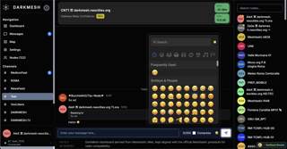
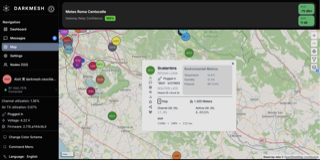
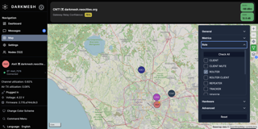
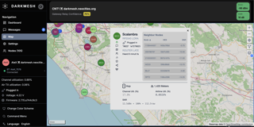
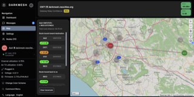

# DMDash

`DMDash` is a DarkMesh-oriented web dashboard built on top of the Meshtastic web client.

This repository uses `meshtastic/web` as the technical base, applies DarkMesh branding and UX, and keeps compatibility with the official Meshtastic protobuf contract so the dashboard can remain interoperable with the wider Meshtastic ecosystem.

## Project Goal

The goal of `DMDash` is to provide a web-first DarkMesh dashboard that:

- preserves Meshtastic protocol compatibility
- reuses the Meshtastic web runtime, transports, and data model
- ports DarkMesh-specific user flows from the Android app into the browser
- stays aligned with DarkMesh firmware branches `2.7.15-ghost` and `2.7.21-ghost`, while comparing against Meshtastic firmware hardware declarations

## What You Can Do Today

The current DMDash build exposes these user-facing capabilities on top of the Meshtastic web base:

- connection manager with `HTTP(S)`, Web Bluetooth, and Web Serial transports
- DarkMesh-branded dashboard with notifications, traceroute history, scheduled message rules, distress beacon controls, hunt forwarding, and NodeDB maintenance tools
- `.dmdb` import/export based on Meshtastic `SharedContact`
- direct and broadcast messaging with replies, mentions, reactions, emoji picker, compression indicators, and clickable avatars
- inline node `Status Message` display in chat plus avatar badges with unread/read visual state
- map view with live markers, node popups, details dialog, neighbor info, environment metrics, and traceroute overlays
- node list with filters, favorites, signal visibility, encryption status, and quick detail access
- local `Radio`, `Device`, and `Module` settings with firmware-aware tab visibility
- Remote Admin for `Radio`, `Device`, and `Module` configuration on compatible remote nodes
- module settings coverage for features such as `Remote Hardware`, `Status Message`, and `Traffic Management` when supported by firmware

Feature availability still depends on browser capabilities, transport type, node firmware, and device role.

## User Documentation

Non-technical, task-oriented documentation is served directly by the web app build. The guide landing page also acts as the lightweight demo entry point for the current UI/workflow coverage:

- in-app demo / guide route: `/guide`
- static landing page: [packages/web/public/guide/index.html](packages/web/public/guide/index.html)
- English guide: [packages/web/public/guide/en/index.html](packages/web/public/guide/en/index.html)
- Italian guide: [packages/web/public/guide/it/index.html](packages/web/public/guide/it/index.html)

When the web app is running locally, open `/guide` on the same host:

```text
http://localhost:3000/guide
```

The static-compatible paths `/guide/index.html`, `/guide/en/index.html`, and `/guide/it/index.html` are also routed by the app, so the demo can be linked from a deployed homepage without special server rules.

### Feature previews

Below are quick previews of selected DarkMesh dashboard features; click a thumbnail to view the full-size image.

- **Messages (chat / emoji picker)**  
  [](assets/screenshots/Chat.png)
- **Map (overview + node popup)**  
  [](assets/screenshots/EnvironmentalMetrics.png)
- **Map filters (role/metrics UI)**  
  [](assets/screenshots/Filters.png)
- **Node popup (neighbor list / metrics)**  
  [](assets/screenshots/NeighborNodes.png)
- **Traceroute overlay (traced route visual)**  
  [](assets/screenshots/VisualTraceroute.png)

## Protocol Compatibility

`DMDash` does not introduce a separate protobuf fork.

The compatibility model is:

- `DarkMesh-Firmware` branches `2.7.15-ghost` and `2.7.21-ghost` are used as DarkMesh firmware references
- `meshtastic/firmware` `master` is used as the Meshtastic firmware hardware reference
- `DarkMesh-Firmware` currently points its `protobufs/` submodule to the official Meshtastic protobuf repository
- `DMDash` therefore keeps the official Meshtastic protobuf schema as the source of truth

For the analysis and current baseline, see:

- [docs/darkmesh-analysis.md](docs/darkmesh-analysis.md)
- [docs/compatibility-matrix.md](docs/compatibility-matrix.md)
- [docs/compatibility-report.md](docs/compatibility-report.md)
- [docs/device-image-coverage.md](docs/device-image-coverage.md)

## Upstream Strategy

This project tracks multiple upstream repositories, but they do not all have the same role:

- `upstream-web`
  - Meshtastic web base
  - the only upstream that is intended to be merged into the dashboard code tree
- `upstream-protobufs`
  - protocol compatibility reference
- `upstream-firmware`
  - Meshtastic firmware hardware declaration reference
- `upstream-darkmesh-android`
  - DarkMesh feature and UX reference
- `upstream-darkmesh-firmware`
  - firmware behavior reference

Policy details are documented in [docs/upstream-policy.md](docs/upstream-policy.md).

## Repository Layout

- `packages/web`
  - the actual web dashboard application
- `packages/core`
  - Meshtastic JS core logic used by the dashboard
- `docs`
  - DarkMesh analysis, compatibility, and upstream policy
- `scripts`
  - upstream sync and compatibility reporting helpers
- `external-sources`
  - local clones of upstream repositories used for analysis and sync
  - intentionally excluded from git tracking in this repository

## Development

### Prerequisites

- `pnpm`
- Node.js compatible with the workspace dependencies

### Install

```bash
pnpm install
```

### Run the web dashboard

```bash
pnpm --filter meshtastic-web dev
```

### Typecheck

Runtime-focused typecheck:

```bash
pnpm --filter meshtastic-web typecheck
```

Full package typecheck, including tests and support files:

```bash
pnpm exec tsc --noEmit -p packages/web/tsconfig.json
```

### Build

```bash
pnpm --filter meshtastic-web build
```

## Useful scripts

The repository exposes several helpful workspace scripts through the top-level `package.json`. Useful commands include:

- **Install prerequisites**: `pnpm install`
- **Run dev server (web package)**: `pnpm --filter meshtastic-web dev`
- **Typecheck (runtime-focused)**: `pnpm --filter meshtastic-web typecheck`
- **Full package TypeScript check**: `pnpm exec tsc --noEmit -p packages/web/tsconfig.json`
- **Build all packages**: `pnpm run build:all` (runs `build` for all workspace packages)
- **Clean all packages**: `pnpm run clean:all`
- **Sync upstream mirrors**: `pnpm sync:upstreams`
- **Update upstream mirrors (fast-forward when clean)**: `pnpm sync:upstreams:update`
- **Regenerate compatibility report**: `pnpm report:compatibility`
- **Regenerate device image coverage report**: `pnpm report:device-images`
- **Enforce device image coverage guardrail**: `pnpm check:device-images`
- **Lint**: `pnpm run lint` and `pnpm run lint:fix`
- **Format**: `pnpm run format` and `pnpm run format:fix`
- **Check (lint + format)**: `pnpm run check` and `pnpm run check:fix`
- **Run tests**: `pnpm run test`

These map to the scripts defined in the repository root `package.json` and are useful during development and CI.

## Upstream Sync Workflow

Refresh remotes and local mirrors:

```bash
pnpm sync:upstreams
```

Refresh remotes and fast-forward the local mirrors when clean:

```bash
pnpm sync:upstreams:update
```

Regenerate the compatibility snapshot:

```bash
pnpm report:compatibility
```

Regenerate the device image coverage report:

```bash
pnpm report:device-images
```

Run the blocking guardrail for DeviceImage coverage:

```bash
pnpm check:device-images
```

## Browser Runtime Notes

Some DarkMesh Android behaviors depend on long-running foreground services. In the web dashboard, these features operate while the browser tab is open and connected:

- scheduled messages and rule-based sends
- distress beacon loop
- hunting forwarding
- live notification polling tied to the active browser session

This is an intentional browser-side approximation, not a protocol break.

Some settings and Remote Admin subsections are also firmware-gated, so different nodes can expose different tabs.

## Verified Status

At the current repository state:

- `packages/web` runtime typecheck passes
- full `packages/web` typecheck passes
- production build passes
- targeted tests for the recently adapted areas pass

## Upstream Repositories Referenced

- DarkMesh Android: `https://github.com/emp3r0r7/DarkMesh.git`
- DarkMesh Firmware: `https://github.com/emp3r0r7/DarkMesh-Firmware.git`
- Meshtastic Firmware: `https://github.com/meshtastic/firmware.git`
- Meshtastic Protobufs: `https://github.com/meshtastic/protobufs.git`
- Meshtastic Web: `https://github.com/meshtastic/web.git`

## Project Identity

`DMDash` is a DarkMesh dashboard project with a Meshtastic-compatible technical core.

It should be treated as:

- a DarkMesh web experience
- a Meshtastic-compatible dashboard
- a repository that follows upstreams intentionally rather than mixing all histories together

## Screenshot Assets

The images currently referenced by this README live under `assets/screenshots/`:

- `assets/screenshots/Chat.png` — messages / chat preview
- `assets/screenshots/EnvironmentalMetrics.png` — node popup / metrics
- `assets/screenshots/Filters.png` — map filters UI
- `assets/screenshots/NeighborNodes.png` — neighbor list in node popup
- `assets/screenshots/VisualTraceroute.png` — traceroute overlay on the map

## Recent UX Additions

Recent work added or stabilized the following areas:

- clickable message avatars that open node details
- reply previews that jump to the original message
- mention highlighting and improved reply UX
- status message rendering in popup, dialog, chat header, and node avatars
- unread/read status message badge behavior for avatars
- module coverage for `Status Message`, `Traffic Management`, and `Remote Hardware`
- battery and power notification workflows from the DarkMesh dashboard

## Documentation Changelog

Recent README-visible changes:

- documented the in-app demo/guide route at `/guide`, with static-compatible `/guide/index.html` paths
- added the DeviceImage hardware coverage report and guardrail commands
- expanded upstream tracking to include Meshtastic firmware hardware declarations
- updated compatibility wording to cover DarkMesh `2.7.15-ghost`, DarkMesh `2.7.21-ghost`, and Meshtastic firmware
