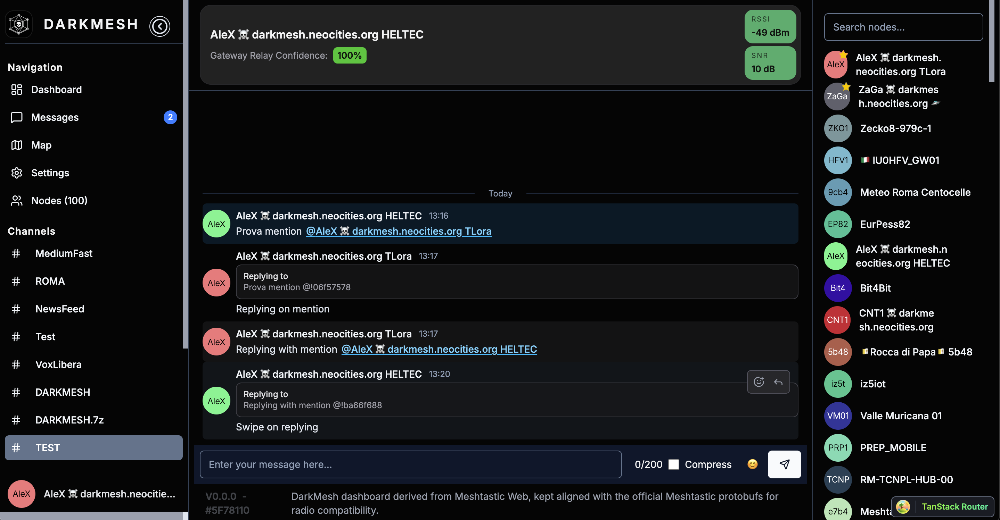

# DMDash

`DMDash` is a DarkMesh-oriented web dashboard built on top of the Meshtastic web client.

This repository uses `meshtastic/web` as the technical base, applies DarkMesh branding and UX, and keeps compatibility with the official Meshtastic protobuf contract so the dashboard can remain interoperable with the wider Meshtastic ecosystem.

## Project Goal

The goal of `DMDash` is to provide a web-first DarkMesh dashboard that:

- preserves Meshtastic protocol compatibility
- reuses the Meshtastic web runtime, transports, and data model
- ports DarkMesh-specific user flows from the Android app into the browser
- stays aligned with the DarkMesh firmware branch `2.7.15-ghost`

## Current DarkMesh Features

The DarkMesh layer currently adds these features on top of the Meshtastic web base:

- DarkMesh dashboard route and project branding
- scheduled messaging
- distress beaconing
- hunting endpoint forwarding
- gateway detection heuristics
- traceroute overlay rendering on the map
- `.dmdb` import/export based on Meshtastic `SharedContact`
- reply-aware message UX using `replyId`

### Feature previews

Below are quick previews of selected DarkMesh dashboard features; click a thumbnail to view the full-size image.

- **Messages (chat / emoji picker)**  
  [](assets/screenshots/Chat.png)
- **Map (overview + node popup)**  
  [](assets/screenshots/EnvironmentalMetrics.png)
- **Map filters (role/metrics UI)**  
  [](assets/screenshots/Filters.png)
- **Node popup (neighbor list / metrics)**  
  [](assets/screenshots/NeighborNodes.png)
- **Traceroute overlay (traced route visual)**  
  [](assets/screenshots/VisualTraceroute.png)

## Protocol Compatibility

`DMDash` does not introduce a separate protobuf fork.

The compatibility model is:

- `DarkMesh-Firmware` branch `2.7.15-ghost` is used as the firmware reference
- `DarkMesh-Firmware` currently points its `protobufs/` submodule to the official Meshtastic protobuf repository
- `DMDash` therefore keeps the official Meshtastic protobuf schema as the source of truth

For the analysis and current baseline, see:

- [docs/darkmesh-analysis.md](docs/darkmesh-analysis.md)
- [docs/compatibility-matrix.md](docs/compatibility-matrix.md)
- [docs/compatibility-report.md](docs/compatibility-report.md)

## Upstream Strategy

This project tracks multiple upstream repositories, but they do not all have the same role:

- `upstream-web`
  - Meshtastic web base
  - the only upstream that is intended to be merged into the dashboard code tree
- `upstream-protobufs`
  - protocol compatibility reference
- `upstream-darkmesh-android`
  - DarkMesh feature and UX reference
- `upstream-darkmesh-firmware`
  - firmware behavior reference

Policy details are documented in [docs/upstream-policy.md](docs/upstream-policy.md).

## Repository Layout

- `packages/web`
  - the actual web dashboard application
- `packages/core`
  - Meshtastic JS core logic used by the dashboard
- `docs`
  - DarkMesh analysis, compatibility, and upstream policy
- `scripts`
  - upstream sync and compatibility reporting helpers
- `external-sources`
  - local clones of upstream repositories used for analysis and sync
  - intentionally excluded from git tracking in this repository

## Development

### Prerequisites

- `pnpm`
- Node.js compatible with the workspace dependencies

### Install

```bash
pnpm install
```

### Run the web dashboard

```bash
pnpm --filter meshtastic-web dev
```

### Typecheck

Runtime-focused typecheck:

```bash
pnpm --filter meshtastic-web typecheck
```

Full package typecheck, including tests and support files:

```bash
pnpm exec tsc --noEmit -p packages/web/tsconfig.json
```

### Build

```bash
pnpm --filter meshtastic-web build
```

## Useful scripts

The repository exposes several helpful workspace scripts through the top-level `package.json`. Useful commands include:

- **Install prerequisites**: `pnpm install`
- **Run dev server (web package)**: `pnpm --filter meshtastic-web dev`
- **Typecheck (runtime-focused)**: `pnpm --filter meshtastic-web typecheck`
- **Full package TypeScript check**: `pnpm exec tsc --noEmit -p packages/web/tsconfig.json`
- **Build all packages**: `pnpm run build:all` (runs `build` for all workspace packages)
- **Clean all packages**: `pnpm run clean:all`
- **Sync upstream mirrors**: `pnpm sync:upstreams`
- **Update upstream mirrors (fast-forward when clean)**: `pnpm sync:upstreams:update`
- **Regenerate compatibility report**: `pnpm report:compatibility`
- **Lint**: `pnpm run lint` and `pnpm run lint:fix`
- **Format**: `pnpm run format` and `pnpm run format:fix`
- **Check (lint + format)**: `pnpm run check` and `pnpm run check:fix`
- **Run tests**: `pnpm run test`

These map to the scripts defined in the repository root `package.json` and are useful during development and CI.

## Upstream Sync Workflow

Refresh remotes and local mirrors:

```bash
pnpm sync:upstreams
```

Refresh remotes and fast-forward the local mirrors when clean:

```bash
pnpm sync:upstreams:update
```

Regenerate the compatibility snapshot:

```bash
pnpm report:compatibility
```

## Browser Runtime Notes

Some DarkMesh Android behaviors depend on long-running foreground services. In the web dashboard, these features operate while the browser tab is open and connected:

- scheduled messages
- distress beacon loop
- hunting forwarding

This is an intentional browser-side approximation, not a protocol break.

## Verified Status

At the current repository state:

- `packages/web` runtime typecheck passes
- full `packages/web` typecheck passes
- production build passes
- targeted tests for the recently adapted areas pass

## Upstream Repositories Referenced

- DarkMesh Android: `https://github.com/emp3r0r7/DarkMesh.git`
- DarkMesh Firmware: `https://github.com/emp3r0r7/DarkMesh-Firmware.git`
- Meshtastic Protobufs: `https://github.com/meshtastic/protobufs.git`
- Meshtastic Web: `https://github.com/meshtastic/web.git`

## Project Identity

`DMDash` is a DarkMesh dashboard project with a Meshtastic-compatible technical core.

It should be treated as:

- a DarkMesh web experience
- a Meshtastic-compatible dashboard
- a repository that follows upstreams intentionally rather than mixing all histories together

## Screenshots

The following images show several main dashboard features. Image files are expected under `assets/screenshots/`.

- **Messages (chat / emoji picker)**: `assets/screenshots/messages.png`
- **Map (overview + node popup)**: `assets/screenshots/map.png`
- **Map filters (role/metrics UI)**: `assets/screenshots/filters.png`
- **Node popup (neighbor list / metrics)**: `assets/screenshots/node-popup.png`
- **Traceroute overlay (traced route visual)**: `assets/screenshots/traceroute.png`

The images used in this README are available in `assets/screenshots/`:

- `assets/screenshots/Chat.png` — messages / chat preview
- `assets/screenshots/EnvironmentalMetrics.png` — node popup / metrics
- `assets/screenshots/Filters.png` — map filters UI
- `assets/screenshots/NeighborNodes.png` — neighbor list in node popup
- `assets/screenshots/VisualTraceroute.png` — traceroute overlay on the map

## New features (April 2026)

Recent work added several UX and compatibility improvements:

- Mention autocomplete: local node is automatically excluded from suggestion results when matching (avoid self-mention).
- Reply UX: reply preview is clickable — clicking a replied-to preview scrolls and highlights the original message.
- Message highlighting: messages that mention the local node and reply targets are visually highlighted to match DarkMesh Android styling.
- Clickable avatars: message avatars open the node details dialog when clicked.
- Swipe-to-reply: quick swipe gesture on messages to start a reply.
- Core reliability: fixed requestId correlation in `packages/core` so routing ACKs properly resolve queued packets.
- Accessibility and lint fixes across web package (keyboard support for the reaction picker, typing improvements, and eslint compliance).

Screenshot (add the actual image at `assets/screenshots/reply-highlight.png`):



To update the screenshot, replace `assets/screenshots/reply-highlight.png` with a 1280×720 (or similar) PNG exported from the app, then commit and push.
